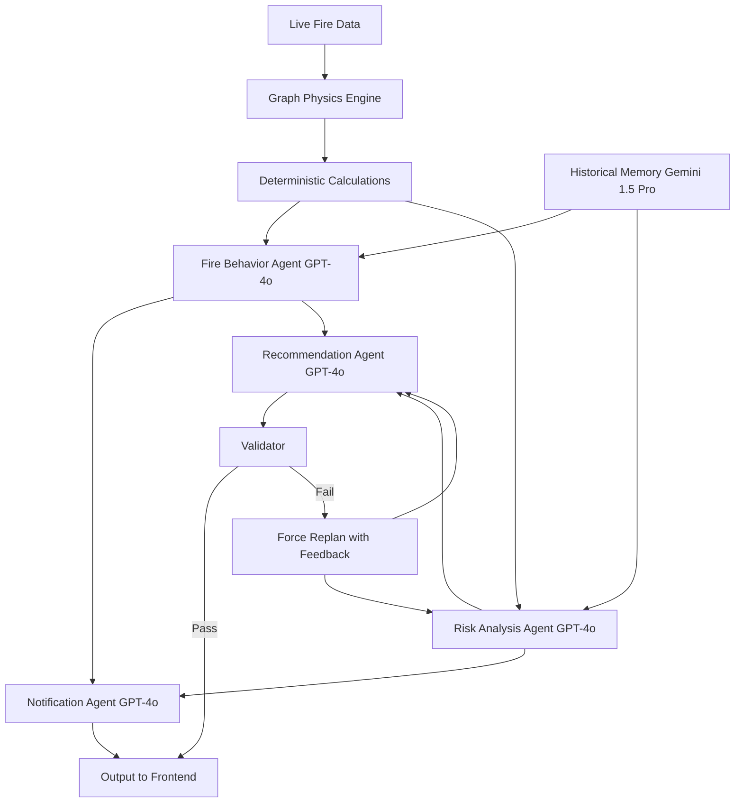

# 🔥 WildfireOS

**AI-Powered Wildfire Intelligence & Command System**

A real-time multi-agent decision support system for wildfire incident command, combining deterministic physics calculations with coordinated AI agents to provide tactical recommendations, threat assessments, and automated alerts.

---

## 🚀 Quick Start

```bash
# 1. Setup environment
cp .env.example .env
# Edit .env and add your API keys

# 2. Start backend (Terminal 1)
cd backend
pip install -r requirements.txt
python main.py

# 3. Start frontend (Terminal 2)
cd frontend
npm install
npm run dev

# 4. Open http://localhost:5173
```

📚 **Full documentation**: See [`docs/QUICK_START.md`](docs/QUICK_START.md)

---

## 🎯 Overview

WildfireOS is a command-and-control platform designed for wildfire incident commanders. It integrates:

- **Real-time fire behavior physics** - Deterministic calculations for spread velocity, threat levels
- **Multi-agent AI orchestration** - 6 specialized agents (GPT-4o + Gemini) coordinating analysis
- **Closed-loop validation** - AI outputs must pass physics constraints or trigger automatic replanning
- **Interactive mapping** - Leaflet-based visualization with fire perimeters, terrain, infrastructure
- **Historical memory** - Context-aware recommendations based on similar past incidents

### Key Features

✅ **Physics-grounded AI** - Agents cannot contradict deterministic fire behavior calculations
✅ **Automatic error correction** - Failed validation triggers agent replanning (max 2 retries)
✅ **Real-time streaming** - WebSocket support for live status updates as agents work
✅ **Historical context** - Gemini 1.5 Pro analyzes past fires with similar conditions
✅ **Tactical alerts** - Structured notifications for evacuation threats, power lines, resource needs

---

## 🏗️ Architecture

### Frontend (React + Vite + Leaflet)

```
frontend/
├── src/
│   ├── components/
│   │   ├── FireMap.jsx          # Main map with fire perimeters, spread arrows
│   │   ├── InsightsPanel.jsx    # Alert cards with acknowledgment system
│   │   └── LayerControls.jsx    # Toggle fuel types, terrain, historical fires
│   ├── hooks/
│   │   └── useFireData.js       # Custom hook for fetching data from backend
│   ├── services/
│   │   └── dataService.js       # Backend API client
│   └── App.jsx                  # Main app with alert management
```

**Map Visualizations:**
- Fire perimeter + active front with spread velocity arrows
- Wind direction arrows across map grid
- Evacuation zones (Order/Warning) with population counts
- Power lines with threat indicators
- Firebreaks (dozer/hand lines) with condition status
- Historical fire scars (highlighted when in current path)
- Terrain layers (fuel types, ridgelines, water resources)

### Backend (FastAPI + OpenAI + Gemini)

```
backend/
├── agents/
│   ├── orchestrator.py          # Multi-agent coordination engine
│   └── historical_memory.py     # Gemini-powered historical context
├── data/
│   └── historical_fires.json    # Past incident database
└── main.py                      # FastAPI server with REST + WebSocket
```

**Agent Pipeline:**



**Agents:**

1. **Graph Physics Engine** - Computes base spread velocity, slope/vegetation multipliers, baseline threat
2. **Fire Behavior Agent** (GPT-4o) - Analyzes wind, slope, vegetation effects on spread
3. **Risk Analysis Agent** (GPT-4o) - Identifies threatened infrastructure, assigns threat levels
4. **Notification Agent** (GPT-4o) - Generates 3 tactical alerts (exactly 2 sentences each)
5. **Recommendation Agent** (GPT-4o) - Provides top consideration for incident command
6. **Historical Memory Agent** (Gemini 1.5 Pro) - Finds analogous past fires, contextualizes behavior
7. **Validator** - Ensures AI outputs obey physics (critical threats must match deterministic baseline)

---

## 🚀 Quick Start

### Prerequisites

- **Node.js** 18+ and npm
- **Python** 3.10+
- **OpenAI API Key** - [Get one here](https://platform.openai.com/api-keys)
- **Google Gemini API Key** - [Get one here](https://aistudio.google.com/app/apikey)

### Installation

```bash
# 1. Clone and navigate to project
cd containment

# 2. Install frontend dependencies
cd frontend
npm install

# 3. Install backend dependencies
cd ../backend
pip install -r ../requirements.txt

# 4. Configure API keys
cd ..
cp .env.example .env
# Edit .env and add your OPENAI_API_KEY and GEMINI_API_KEY
```

### Running the Application

**Terminal 1 - Backend:**
```bash
cd backend
python main.py
```
- API: http://localhost:8000
- Docs: http://localhost:8000/docs
- WebSocket: ws://localhost:8000/ws

**Terminal 2 - Frontend:**
```bash
cd frontend
npm run dev
```
- App: http://localhost:5173

---

## 📡 API Reference

### REST Endpoint

**POST** `/api/analyze`

Request:
```json
{
  "live_graph": {
    "step": 10,
    "total_burning": 450,
    "total_burned": 2300
  },
  "wind_data": {
    "speed": 25,
    "direction": 45
  },
  "environment_data": {
    "slope": 30,
    "terrain_vegetation": "chaparral"
  },
  "infrastructure_data": {
    "nearby_towns": [
      {"name": "Pine Grove", "distance_km": 4.5}
    ]
  },
  "previous_recommendation": null
}
```

Response:
```json
{
  "notifications": [
    {
      "headline": "Critical uphill spread detected",
      "explanation": "Fire advancing into steep chaparral slope. Spread velocity will increase 80% over next 2 hours."
    }
  ],
  "recommendation": {
    "consideration": "Deploy Type 1 crew to Ridge Road",
    "rationale": "Physics shows critical exposure to Pine Grove within 4 hours. Ridge Road provides last defensible anchor point.",
    "confidence_score": 85
  },
  "computed_physics": {
    "base_spread_velocity": 45.0,
    "effective_velocity_multiplier": 1.8,
    "effective_spread_velocity": 81.0,
    "deterministic_baseline_threat": "CRITICAL",
    "critical_exposures_identified": ["Pine Grove is 4.5km away"]
  },
  "history_summary": "Canyon Creek Fire (2022) exhibited similar chaparral upslope behavior. Required 5x resource escalation when fire reached ridge."
}
```

### WebSocket Endpoint

**Connect:** `ws://localhost:8000/ws`

Send fire data, receive streaming updates:

```json
// Status updates during processing
{
  "type": "status_update",
  "status": {
    "graph_physics": "complete",
    "level_1_agents": "running",
    "level_2_agents": "idle",
    "validation": "idle"
  }
}

// Final results
{
  "type": "analysis_complete",
  "data": { /* same as REST response */ }
}
```

---

## 🧪 How It Works: Closed-Loop Validation

WildfireOS uses a **deterministic physics engine** to establish ground truth, then validates all AI outputs against it:

```python
# Deterministic baseline
if slope > 20: threat = "CRITICAL"
if town_distance < 5km: threat = "CRITICAL"

# AI Risk Agent outputs: "ELEVATED"
# ❌ Validator catches contradiction

# System forces replan with feedback:
# "Physics violation: deterministic calculates CRITICAL but you output ELEVATED. You MUST escalate."

# AI tries again with corrective feedback → outputs "CRITICAL"
# ✅ Validator approves
```

This prevents AI hallucination and ensures recommendations are grounded in fire behavior physics.

---

## 🛠️ Development

### Adding Custom Historical Fires

Edit `backend/data/historical_fires.json`:

```json
{
  "name": "Your Fire Name",
  "year": 2024,
  "conditions": {
    "windSpeed": 30,
    "slope": 25,
    "vegetation": "timber"
  },
  "keyLesson": "What made this fire unique",
  "resources": {
    "initialEngines": 10,
    "peakEngines": 50,
    "escalationNote": "Why resources increased"
  }
}
```

### Customizing Agent Behavior

Edit `backend/agents/orchestrator.py`:

- **Adjust validation rules** (lines 98-124)
- **Modify physics calculations** (lines 40-94)
- **Add new agent types** - Create async function, add to execution graph

### Frontend Customization

Edit mock data:
- `frontend/src/data/firePerimeter.js` - Active fire state
- `frontend/src/data/terrain.js` - Fuel zones, topography
- `frontend/src/data/infrastructure.js` - Communities, firebreaks

---

## 📊 Tech Stack

| Component | Technology | Purpose |
|-----------|-----------|---------|
| Frontend | React 19 + Vite | UI framework |
| Mapping | Leaflet + react-leaflet | Interactive fire maps |
| Backend | FastAPI + Uvicorn | API server |
| AI Orchestration | OpenAI GPT-4o | Multi-agent reasoning |
| Historical Memory | Google Gemini 1.5 Pro | Context window for past fires |
| Validation | Pydantic + Custom Logic | Type safety + physics checks |
| Real-time | WebSockets | Streaming updates |

---

## 📝 License

TreeHacks 2026 Project

---

## 🤝 Contributing

Built for TreeHacks 2026. For issues or questions, please open an issue in the repository.

---

## 🔗 Resources

- [FastAPI Documentation](https://fastapi.tiangolo.com/)
- [OpenAI Structured Outputs](https://platform.openai.com/docs/guides/structured-outputs)
- [Google Gemini API](https://ai.google.dev/docs)
- [Leaflet Maps](https://leafletjs.com/)
- [Wildfire Behavior Fundamentals](https://www.nwcg.gov/)

---

**Built with ❤️ for wildfire incident commanders**

---

## 📚 Documentation

- **[Quick Start](docs/QUICK_START.md)** - Get running in 5 minutes
- **[Project Structure](docs/PROJECT_STRUCTURE.md)** - Architecture overview
- **[Data Consolidation](docs/DATA_CONSOLIDATION_README.md)** - Data flow and API
- **[Setup Guide](docs/SETUP.md)** - Detailed installation instructions

## 📁 Project Structure

```
containment/
├── backend/              # Python/FastAPI backend
│   ├── agents/          # Multi-agent AI system
│   ├── data/            # JSON data files (single source of truth)
│   ├── main.py          # API endpoints
│   └── requirements.txt
├── frontend/            # React/Vite frontend
│   ├── src/
│   │   ├── components/  # React components
│   │   ├── hooks/       # Custom hooks (useFireData)
│   │   └── services/    # API client (dataService)
│   └── package.json
├── docs/                # Documentation
├── .env.example         # Environment template
└── README.md           # This file
```

## 🔑 Environment Variables

### Backend
```bash
GEMINI_API_KEY=your_gemini_key      # For historical memory
OPENAI_API_KEY=your_openai_key      # For multi-agent system
```

### Frontend (optional)
```bash
VITE_API_URL=http://localhost:8000  # Backend API URL
```

## 🛠️ Development

### Backend
```bash
cd backend
python main.py                       # Runs on http://localhost:8000
# API docs: http://localhost:8000/docs
```

### Frontend
```bash
cd frontend
npm run dev                          # Runs on http://localhost:5173
npm run build                        # Production build
```

## 🧪 Testing

Verify the system is working:

```bash
# Backend health check
curl http://localhost:8000/health

# Get all data
curl http://localhost:8000/api/data/all

# Frontend: Open http://localhost:5173
# - Map should show fire perimeter
# - Alerts should appear in sidebar
```

